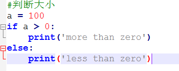

#1.基础语法
##例子

>解释:
- 注释 井作为标志
- 语句 ：作为的结尾
- 缩进 以缩进4个空格作为标准
- python大小写敏感

##基本数据类型
- 整型   
    整数或者负数。另外：十六进制，以0X 前缀和0-9，a-f表示     
- 浮点型   
    小数点的位置不确定     
- 布尔值       
    布尔值True、Flase(区分大小写)        
    布尔值运算 and(两个为True才为True)、or(一个为True均为True)、not(相反)      
- 空值    
    区分空值None    
- 变量        
    以大小字母、数字、下划线命名，但不能以数字开头     
    静态语言：变量类型不变  int a = 1; a = "10"; //JAVA error        
    动态语言：变量类型可变  int a = 1; a = "10"  //Python right
- 常量        
    以大写字母命名PI,但是常量仍然是一个可变的变量
- 运算    
    整除： 10/3    3.3333333       
    取整： 10//3   3       
    求余： 10%3    1 
- 字符串       
    以单引号或双引号，括起来的任意文本，另外：转义字符的用法\  
    字符串格式化          
    >以%作为匹配。        
    例如：print(('我睡觉哦%s,%s 几岁人了，还这样....')%('你大爷',10))     
    以format作为匹配              
    例如：print(('我睡觉哦{0},{1} 几岁人了，还这样....%').format('你大爷',10))
    
    

        

      
 

 