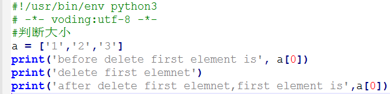
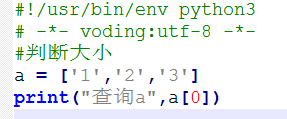
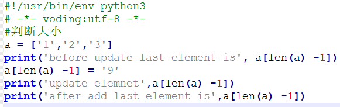
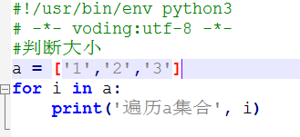

#集合
##List集合
- 增加        

- 删除            

- 查询                   

- 修改            
      
- 遍历                      
         

> 集合里的元素可以是任何类型的元素          

##tuple
特点：tuple里面的元素不可变化，所以不能使用insert(),append()

#dir        
相当于java中的map

- 初始化       
```angular2html
    d = {}   
    d = {'姓':'zhao','名称':'shanwei'}
```
- 增加        
```angular2html
    d['GO'] = 'zhao' 
    print(d['GO'])
```
- 删除
```angular2html
    d.pop('姓')
```
- 查询
```angular2html
    d.get('姓')#ok
    #d['姓']   #error，因为前面删除了
```
- 遍历    
```angular2html
    ##dirt对key遍历
    for i in d:
    	print('foreach key dirt')
    	print(d.get(i))
```
```angular2html
    ##dirt对items遍历
    for (k,v) in d.items():
    	print('foreach dirt items')
    	print('key:', k,'value:',v)
```

#Set        
保存不可变参数,要创建一个set，需要提供一个list作为输入集合      
- 初始化
```angular2html
    s = set([9])
    print(s)
```
- 添加
```angular2html
    s.add(8)
    print(s)
```
- 删除
```angular2html
    s.remove(9)
    print(s)
```

      
 

 